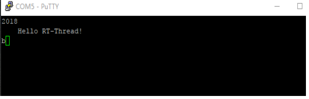

# 应用笔记AN0001：Serial设备应用笔记

本应用笔记描述了如何使用RT-Thread的串口设备，包括串口配置、设备操作接口的应用。并给出了在正点原子STM32F4探索者开发板上验证的代码示例。


## 1 本文的目的和结构 ##


### 1.1 本文的目的和背景 ###

串口（通用异步收发器，常写作UART、uart）是最为广泛使用的通信接口之一。在裸机平台或者是没有设备管理框架的RTOS平台上，我们通常只需要根据官方手册编写串口硬件初始化代码即可。引入了带设备管理框架的实时操作系统RT-Thread后，串口的使用则与裸机或者其它RTOS有很大的不同之处。RT-Thread中自带I/O设备管理层，将各种各样的硬件设备封装成具有统一接口的逻辑设备，方便管理及使用。本文说明了如何在RT-Thread中使用串口。

### 1.2 本文的结构 ###

本文首先给出使用RT-Thread的设备操作接口开发串口收、发数据程序的示例代码，并在正点原子STM32F4探索者开发板上验证。接着分析了示例代码的实现，最后深入地描述了RT-Thread设备管理框架与串口的联系。

## 2 问题阐述 ##

RT-Thread提供了一套简单的I/O设备管理框架，它把I/O设备分成了三层进行处理：应用层、I/O设备管理层、硬件驱动层。应用程序通过RT-Thread的设备操作接口获得正确的设备驱动，然后通过这个设备驱动与底层I/O硬件设备进行数据（或控制）交互。RT-Thread提供给上层应用的是一个抽象的设备操作接口，给下层设备提供的是底层驱动框架。

<center></center>
<center>图1 RT-Thread设备管理框架</center>

那么用户如何使用设备操作接口开发出跨平台的串口应用代码呢？

## 3 问题的解决 ##

本文基于正点原子STM32F4探索者开发板，给出了串口的配置流程和应用代码示例。由于RT-Thread设备操作接口的通用性，因此这些代码与硬件平台无关，读者可以直接将它用在自己使用的硬件平台上。
正点原子STM32F4探索者开发板使用的是STM32F407ZET6，具有多路串口。我们使用串口1作为shell终端，串口2作为实验用串口，测试数据收发。终端软件使用putty。板载串口1带有USB转串口芯片，因此使用USB 线连接串口1和PC即可；串口2则需要使用USB转串口模块连接到PC。

<center></center>
<center>图2 实验使用的正点原子STM32F4探索者</center>

### 3.1 准备和配置工程 ###

1.下载[RT-Thread源码](https://github.com/RT-Thread/rt-thread)

2.进入rt-thread\bsp\stm32f4xx-HAL目录，在env命令行中输入menuconfig，进入配置界面，使用menuconfig工具（学习如何使用）配置工程。

(1) 配置shell使用串口1：RT-Thread Kernel ---> Kernel Device Object ---> 修改the device name for console为uart1。

(2) 勾选Using UART1、Using UART2，选择芯片型号为STM32F407ZE，时钟源为外部8MHz，如图所示：

<center></center>
<center>图3 使用menuconfig配置串口</center>

3.输入命令scons --target=mdk5 -s生成keil工程，打开工程后先修改MCU型号为STM32F407ZETx，如图所示：

<center></center>
<center>图4 检查芯片型号</center>

4.打开putty，选择正确的串口，软件参数配置为115200-8-1-N、无流控。如图所示：

<center></center>
<center>图5 putty配置</center>

5.编译、下载程序，按下复位后就可以在串口1连接的终端上看到RT-Thread标志log了，输入list_device命令能查看到uart1、uart2 Character Device就表示串口配置好了。

<center></center>
<center>图6 使用list_device命令查看uart设备</center>

### 3.2 加入串口相关代码 ###

<center></center>
<center>图7 添加本文提供的文件到工程</center>

本应用笔记附带代码app_uart.c、app_uart.h，app_uart.c中是串口相关操作的代码，方便阅读。app_uart.c中提供了4个函数uart_open、uart_putchar、uart_putstring、uart_getchar 以方便使用串口。app_uart.c中的代码与硬件平台无关，读者可以把它直接添加到自己的工程。利用这几个函数在main.c中编写测试代码。
main.c源码如下：
```
#include "app_uart.h"
#include "board.h"
void test_thread_entry(void* parameter)
{    
    rt_uint8_t uart_rx_data;
    /* 打开串口 */
    if (uart_open("uart2") != RT_EOK)
    {
        rt_kprintf("uart open error.\n");
         while (1)
         {
            rt_thread_delay(10);
         }
    }
    /* 单个字符写 */
    uart_putchar('2');
    uart_putchar('0');
    uart_putchar('1');
    uart_putchar('8');
    uart_putchar('\n');
    /* 写字符串 */
    uart_putstring("Hello RT-Thread!\r\n");
    while (1)
    {   
        /* 读数据 */
        uart_rx_data = uart_getchar();
        /* 错位 */
        uart_rx_data = uart_rx_data + 1;
        /* 输出 */
        uart_putchar(uart_rx_data);
    }            
}
int main(void)
{
    rt_thread_t tid; 
    /* 创建test线程 */
    tid = rt_thread_create("test",
                    test_thread_entry, 
                    RT_NULL,
                    1024, 
                    2, 
                    10);
    /* 创建成功则启动线程 */
    if (tid != RT_NULL)
        rt_thread_startup(tid);
    return 0;
}

```
这段程序实现了如下功能：

1. main函数里面创建并启动了测试线程test_thread_entry。

2. 测试线程调用uart_open函数打开指定的串口后，首先使用uart_putchar函数发送字符和uart_putstring函数发送字符串。

3. 接着在while循环里面调用uart_getchar函数读取接收到的数据并保存到局部变量uart_rx_data中，最后将数据错位后输出。

### 3.3 运行结果 ###

编译、将代码下载到板卡，复位，串口2连接的终端软件putty（软件参数配置为115200-8-1-N、无流控）输出了字符2、0、1、8和字符串Hello RT-Thread!。输入字符 ‘A’，串口2接收到将其错位后输出。实验现象如图所示：

<center></center>
<center>图8 实验现象</center>

> 图中putty连接开发板的串口2作为测试串口。

## 4 进阶阅读 ##

串口通常被配置为接收中断和轮询发送模式。在中断模式下，CPU不需要一直查询等待串口相关标志寄存器，串口接收到数据后触发中断，我们在中断服务程序进行数据处理，效率较高。RT-Thread官方bsp默认便是这种模式。

### 4.1 使用哪个串口 ###

uart_open函数用于打开指定的串口，它完成了串口设备回调函数设置、串口设备的开启和事件的初始化。源码如下：
```
rt_err_t uart_open(const char *name)
{
    rt_err_t res;
    /* 查找系统中的串口设备 */
    uart_device = rt_device_find(name);   
    /* 查找到设备后将其打开 */
    if (uart_device != RT_NULL)
    {   
        res = rt_device_set_rx_indicate(uart_device, uart_intput);
        /* 检查返回值 */
        if (res != RT_EOK)
        {
            rt_kprintf("set %s rx indicate error.%d\n",name,res);
            return -RT_ERROR;
        }
        /* 打开设备，以可读写、中断方式 */
        res = rt_device_open(uart_device, RT_DEVICE_OFLAG_RDWR | 
                             RT_DEVICE_FLAG_INT_RX );       
        /* 检查返回值 */
        if (res != RT_EOK)
        {
            rt_kprintf("open %s device error.%d\n",name,res);
            return -RT_ERROR;
        }
    }
    else
    {
        rt_kprintf("can't find %s device.\n",name);
        return -RT_ERROR;
    }
    /* 初始化事件对象 */
    rt_event_init(&event, "event", RT_IPC_FLAG_FIFO); 
    return RT_EOK;
}
```
简要流程如下：

<center></center>
<center>图9 uart_open函数流程图</center>

uart_open函数使用到的设备操作接口有：rt_device_find、rt_device_set_rx_indicate、rt_device_open。
uart_open函数首先调用rt_device_find根据串口名字获得串口句柄，保存在静态全局变量uart_device中，后面关于串口的操作都是基于这个串口句柄。这里的名字是在drv_usart.c中调用注册函数rt_hw_serial_register决定的，该函数将串口硬件驱动和RT-Thread设备管理框架联系起来了。
```
    /* register UART2 device */
    rt_hw_serial_register(&serial2,
                          "uart2",
                          RT_DEVICE_FLAG_RDWR | RT_DEVICE_FLAG_INT_RX,
                          uart);
```                          
接着调用rt_device_set_rx_indicate设置串口接收中断的回调函数。
最后调用rt_device_open以可读写、中断接收方式打开串口。它的第二个参数为标志，与上面提到的注册函数rt_hw_serial_register保持一致即可。
```
rt_device_open(uart_device, RT_DEVICE_OFLAG_RDWR | RT_DEVICE_FLAG_INT_RX );
```
最后调用rt_event_init初始化事件。
RT-Thread中默认开启了自动初始化机制，因此用户不需要在应用程序中手动调用串口的初始化函数（drv_usart.c中的INIT_BOARD_EXPORT实现了自动初始化）。用户实现的由宏RT_USING_UARTx选定的串口硬件驱动将自动关联到RT-Thread中来（drv_usart.c中的rt_hw_serial_register实现了串口硬件注册）。

### 4.2 串口发送 ###

uart_putchar函数用于发送1字节数据。uart_putchar函数实际上调用的是rt_device_write来发送一个字节，并采取了防出错处理，即检查返回值，失败则重新发送，并限定了超时。源码如下：
```
void uart_putchar(const rt_uint8_t c)
{
    rt_size_t len = 0;
    rt_uint32_t timeout = 0;
    do
    {
        len = rt_device_write(uart_device, 0, &c, 1);
        timeout++;
    }
    while (len != 1 && timeout < 500);
}
```
调用uart_putchar发生的数据流向示意图如下： 

<center></center>
<center>图10 uart_putchar数据流</center>

应用程序调用uart_putchar时，实际调用关系为：rt_device_write ==> rt_serial_write ==> drv_putc，最终数据通过串口数据寄存器发送出去。

### 4.3 串口接收 ###

uart_getchar函数用于接收数据，uart_getchar函数的实现采用了串口接收中断回调机制和事件用于异步通信，它具有阻塞特性。
相关源码如下：
```
/* 串口接收事件标志 */
#define UART_RX_EVENT (1 << 0)
/* 事件控制块 */
static struct rt_event event;
/* 设备句柄 */
static rt_device_t uart_device = RT_NULL;
    
/* 回调函数 */
static rt_err_t uart_intput(rt_device_t dev, rt_size_t size)
{
    /* 发送事件 */
    rt_event_send(&event, UART_RX_EVENT);
    return RT_EOK;
}
rt_uint8_t uart_getchar(void)
{
    rt_uint32_t e;
    rt_uint8_t ch;
    /* 读取1字节数据 */
    while (rt_device_read(uart_device, 0, &ch, 1) != 1)
{
         /* 接收事件 */
        rt_event_recv(&event, UART_RX_EVENT,RT_EVENT_FLAG_AND | 
                      RT_EVENT_FLAG_CLEAR,RT_WAITING_FOREVER, &e);
}
    return ch;
}
```
uart_getchar函数内部有一个while()循环，先调用rt_device_read去读取一字节数据，没有读到则调用rt_event_recv等待事件标志，挂起调用线程；串口接收到一字节数据后产生中断，调用回调函数uart_intput，回调函数里面调用了rt_event_send发送事件标志以唤醒等待该event事件的线程。
调用uart_getchar函数发生的数据流向示意图如下：

<center></center>
<center>图11 uart_getchar数据流</center>

应用程序调用uart_getchar时，实际调用关系为：rt_device_read ==> rt_serial_read ==> drv_getc，最终从串口数据寄存器读取到数据。

### 4.4 I/O设备管理框架和串口的联系 ###

 RT-Thread自动初始化功能依次调用hw_usart_init ==> rt_hw_serial_register ==> rt_device_register完成
了串口硬件初始化，从而将设备操作接口和串口驱动联系起来，我们就可以使用设备操作接口来对串口进行操作。

<center></center>
<center>图12 串口驱动和设备管理框架联系</center>

更多关于I/O设备管理框架的说明和串口驱动实现细节，请参考《RT-Thread编程手册》**第 6 章
I/O设备管理**

在线查看地址：[链接](https://www.rt-thread.org/document/site/zh/1chapters/06-chapter_device/)

## 5 参考 ##

### 5.1 本文所有相关的API ###

> 注意： app_uart.h文件不属于RT-Thread。

#### 5.1.1 API列表 ####

 API                      | 出处
--------------------------|--------------------------------
uart_open                 | app_uart.h
uart_getchar              | app_uart.h   
uart_putchar              | app_uart.h
rt_event_send             | rt-thread\include\rtthread.h
rt_event_recv             | rt-thread\include\rtthread.h
rt_device_find            | rt-thread\include\rtthread.h
rt_device_set_rx_indicate | rt-thread\include\rtthread.h
rt_device_open            | rt-thread\include\rtthread.h
rt_device_write           | rt-thread\include\rtthread.h
rt_device_read            | rt-thread\include\rtthread.h

#### 5.1.2 核心API详解 ####

uart_open：打开串口

**函数原型：**

`rt_err_t uart_open(const char *name)`

**入口参数：**

name：串口名字，根据usart.c中实现的来选择

**返回值：**

RT_EOK 正常

其它 出错

uart_getchar：从串口读取一个字节数据

**函数原型：**

`rt_uint8_t uart_getchar(void)`

**入口参数：**

无

**返回值：**

串口数据

uart_putchar：串口发送一个字节数据

**函数原型：**

`void uart_putchar(const rt_uint8_t c)`

**入口参数：**

c：要发送的数据

**返回值：**

无

rt_device_open：根据设备控制块来打开设备

**函数原型：**

`rt_err_t  rt_device_open (rt_device_t dev, rt_uint16_t oflag)`

**入口参数：**

dev：设备句柄

oflags：访问模式

oflags支持以下参数：
```
RT_DEVICE_OFLAG_CLOSE   /* 设备已经关闭（内部使用）*/
RT_DEVICE_OFLAG_RDONLY  /* 以只读方式打开设备 */
RT_DEVICE_OFLAG_WRONLY  /* 以只写方式打开设备 */
RT_DEVICE_OFLAG_RDWR    /* 以读写方式打开设备 */
RT_DEVICE_OFLAG_OPEN    /* 设备已经打开（内部使用）*/
RT_DEVICE_FLAG_STREAM   /* 设备以流模式打开 */
RT_DEVICE_FLAG_INT_RX   /* 设备以中断接收模式打开 */
RT_DEVICE_FLAG_DMA_RX   /* 设备以DMA接收模式打开 */
RT_DEVICE_FLAG_INT_TX   /* 设备以中断发送模式打开 */
RT_DEVICE_FLAG_DMA_TX   /* 设备以DMA发送模式打开 */
```
**返回值：**

RT_EOK 正常

其它 错误

> 注1：如果设备注册时指定的参数中包括RT_DEVICE_FLAG_STANDALONE参数，此设备
将不允许重复打开，返回-RT_EBUSY。

> 注2：如果上层应用程序需要设置设备的接收回调函数，则必须以INT_RX或者DMA_RX
的方式打开设备，否则不会回调函数。

rt_device_find：根据指定的设备名称查找设备

**函数原型：**

`rt_device_t rt_device_find(const char *name)`

**入口参数：**

name：设备名称

**返回值：**

查找到对应设备将返回相应的设备句柄；否则返回RT_NULL

rt_device_set_rx_indicate：设置一个回调函数，当硬件设备收到数据时回调以通知用程序有数据到达

**函数原型：**
```
rt_err_t
rt_device_set_rx_indicate(rt_device_t dev,
                          rt_err_t (*rx_ind)(rt_device_t dev, rt_size_t size))
```                          
**入口参数：**

dev：设备句柄

rx_ind：接收回调函数

**返回值：**

返回RT_EOK

> 注：当硬件设备接收到数据时，会回调这个函数并把收到的数据长度放在size参数中传递给上层应用。上层应用线程应在收到指示后，立刻从设备中读取数据。

rt_device_read：从设备中读取，或获得数据

**函数原型：**
```
rt_size_t rt_device_read (rt_device_t dev,
                          rt_off_t    pos,
                          void       *buffer,
                          rt_size_t   size)
```                          
**入口参数：**

dev：设备句柄

pos：读取数据偏移量

buffer：内存缓冲区指针，读取的数据将会被保存在缓冲区中

size：读取数据的大小

**返回值：**

返回读到数据的实际大小（如果是字符设备，返回大小以字节为单位；如果是块设备，返回的大小以块为单位）；如果返回0，则需要读取当前线程的errno来判断错误状态。
注：调用这个函数，会从设备dev中获得数据，并存放在buffer缓冲区中。这个缓冲区的最大长度是size。pos根据不同的设备类别存在不同的意义。

rt_device_write：向设备中写入数据

**函数原型：**
```
rt_size_t rt_device_write(rt_device_t dev,
                          rt_off_t    pos,
                          const void *buffer,
                          rt_size_t   size)
```                          
**入口参数：**

dev：设备句柄

pos：写入数据偏移量

buffer：内存缓冲区指针，放置要写入的数据

size：写入数据的大小

**返回值：**

返回写入数据的实际大小(如果是字符设备，返回大小以字节为单位；如果是块设备，
返回的大小以块为单位)；如果返回0，则需要读取当前线程的errno来判断错误状态。
注：调用这个函数，会把缓冲区buffer中的数据写入到设备dev中。写入数据的最大长度是
size。pos根据不同的设备类别存在不同的意义。

### 5.2 讨论和反馈 ###

欢迎登陆[RT-Thread开发者社区](https://www.rt-thread.org/qa/forum.php)进行交流

### 5.3 RT-Thread参考文献 ###

[RT-Thread编程指南](https://www.rt-thread.org/document/site/zh/0preface/00-chapter1-preface/)

### 5.4 PDF版本和代码下载 ###

本文档PDF版本和配套代码，请关注微信公众号：RTThread，回复关键字：『应用笔记』获取

扫一扫关注RT-Thread微信公众号

<center></center>
<center>图13 RT-Thread微信公众号</center>

