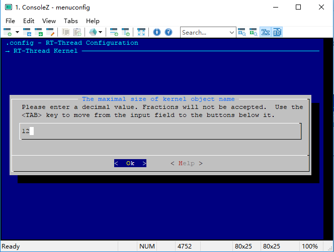
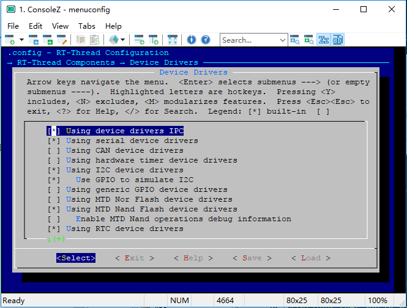
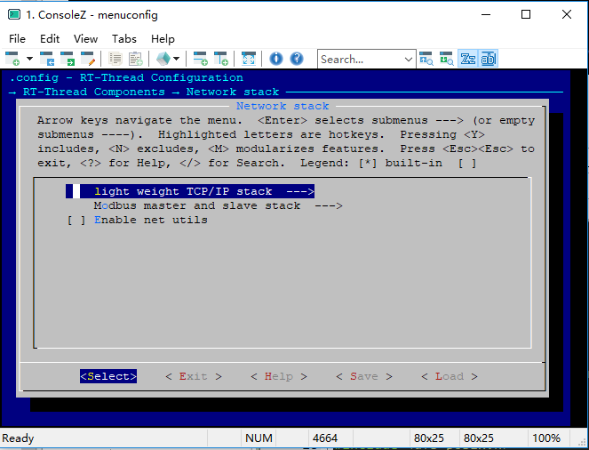
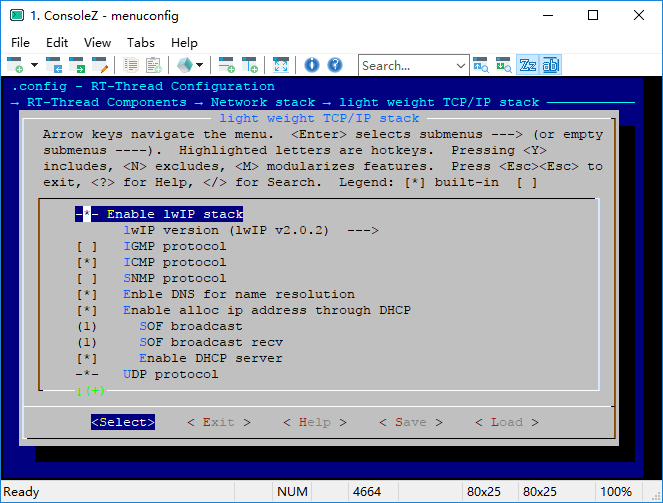
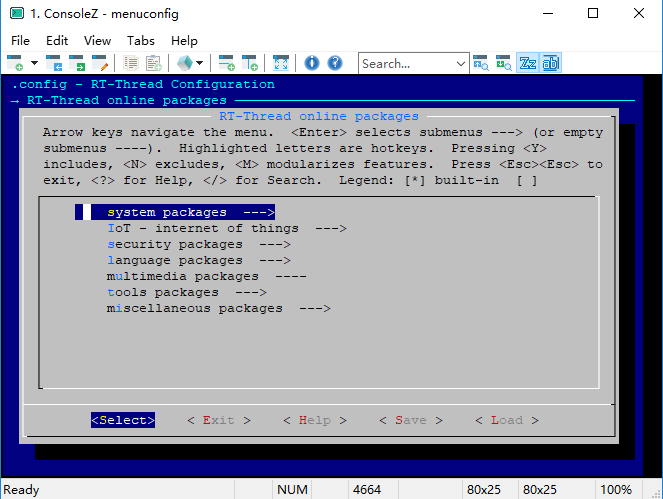

#  [正点原子板]IoT进阶环境搭建
本节以正点原子STM32F429阿波罗开发板为例，说明了如何使用ENV软件包管理工具来配置RT-Thread内核参数、组件、生成Keil MDK工程。
## 1.准备工作

* 参考`RT-Thread 软件包环境`章节
* 正点原子STM32F29阿波罗发板

## 2.配置方法
menuconfig工具支持对内核、组件、在线软件包、BSP 4大部分进行裁剪和参数配置。

#### 内核配置

在\bsp\stm32f429-apollo目录中使用`menuconfig`命令开始进行项目配置，`menuconfig`界面如下图：

第一项就是内核的配置了，选中，点击`Enter`进入子目录如下：

注：左下角的绿色`↓(＋)`表示还有下一页，按`↓键`可向下翻页。

内核配置部分包括RT-Thread内核所有参数的配置，如心跳Tick、最大线程数、栈溢出检查、信号量、互斥锁、邮箱、消息队列、信号（3.0新特性）、钩子函数、内存管理策略、终端等。

我们以内核对象名最大长度的配置为例：
选中第一项，点击Enter进入详细页，我们把它改为12看看：

点击Enter退出：

可以看到已经修改好了。这些参数其实就是RT-Thread配置文件rtconfig.h里面的，其它参数的修改类似，实际中根据需要修改即可，即可达到裁剪、配置内核的目的。

#### 组件配置

选中`RT-Thread Components`进入组件配置菜单：

组件配置菜单提供了C++支持、shell、文件系统、设备驱动、POSIX和C标准库、网络协议栈、GUI等参数配置选项。

#### 在线组件包

RT-Thread支持在线组件包安装，即从RT-Thread下载所需的软件包到本地，包括轻量级数据库、IoT相关协议、JS脚本支持、音频、日志记录和Cortex-M错误诊断工具等。

## 3.编译RT-Thread

使用命令`scons`完成基本的编译，输入`scons --target=mdk5 -s`即可自动在设备目录下生成keil mdk5工程，工程名为project。

或者输入`scons --target=mdk4 -s`生成的是keil mdk4工程。

打开project.uvprojx可以看到，自动添加好了文件。

