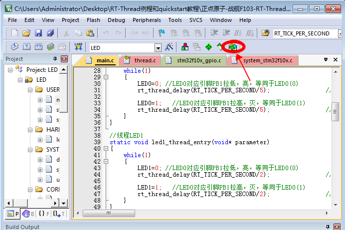

# 正点原子 Nano 入门  #

#  [正点原子板]Nano环境搭建
何为RT-Thread Nano？大家知道，Keil5以后采用pack形式管理芯片及各种相关组件的。RT-Thread Nano就是通过Keil pack方式发布，在保持原有RT-Thread基本功能的情况下，实现了极小的Flash和RAM占用。默认配置下，Flash可小至2.5K， RAM可以小至1K。

目前pack包含有kernel、shell（msh）、device drivers三部分功能，这3个功能可按实际使用情况按需加载。

本节以正点原子开发板为例，说明了如何使用Keil MDK的软件包管理工具安装RT-Thread Nano，在此基础上实现创建2个LED闪烁的静态线程的示例。
正点原子论坛地址`http://www.openedv.com/thread-230240-1-1.html`
## 1.准备工作

* 安装好Keil MDK软件
* 正点原子开发板（其它的开发板类似）

## 2.操作步骤

#### 第一步：RT-ThreadNano Pack下载安装

-  打开正点原子任何一款开发板的跑马灯实验库函数版本（F1和F407为标准库，F429和F767为HAL库）。

- 在MDK5主界面上点击“Pack Install”按钮，即可进入Pack Install界面。
 
   

-  在Pack Install界面下，RT-Thread Pack在右边栏中。如未下载，可点击“Install”下载；如已安装，版本有更新，将提示“Update”可更新。 

   

- 如果在图2界面“Packs”栏中未发现“RT-Thread”，我们可以通过两种方法获取RT-Thread Pack。第一种方法是直接从链接`http://www.rt-thread.org/download/mdk/rt-thread.rtthread.2.1.1.pack`
下载2.1.1版本的的RT-Thread Pack，然后双击完成安装。第二种方法是在菜单“Packs”下点击“Check for Updates”，Update需要一定的时间。Update完成后，将可看到RT-Thread Pack。Pack下载完成后Keil将自动弹出Pack安装界面，按步骤依次完成安装。

#### 第二步：kernel加载与应用

- 加载RT-Thread Kernel:在主界面点击“ManageRun-TimeEnvironment”按钮即可进入加载页。

在“RTOS”一栏中选中“RT-Thread”，并在列表中选中“kernel”，当前版本为2.1.2。

-  确定后，keil界面上会加载RT-Thread的kernel文件，会根据当前选择芯片类型加入已移植完成的芯片内核代码、配置文件等。

其中，Kernel文件包括：

- clock.c
- components.c
- device.c
- idle.c
- ipc.c
- irq.c
- kservice.c
- mem.c
- object.c
- scheduler.c
- thread.c
- timer.c

Cortex-M芯片内核移植代码：

- cpuport.c
- context_rvds.s

应用代码及配置文件：

- board.c
- rtconfig.h

#### 第三步：修改源码适配开发板

此时再次编译工程，编译器会提示有函数被重复定义了。需按照如下方式做一些修改：

- 修改stm32fXXXX_it.c文件（stm32f103对应的文件为stm32f10x_it.c，stm32f4对应的文件为stm32f4xx_it.c，stm32f7对应的文件为stm32f7xx_it.c），删除如下函数：

    void HardFault_Handler(void);
    
    void PendSV_Handler(void);
    
    void SysTick_Handler(void);

- 按照应用代码board.c上的说明，依次修改相关代码：

修改第24行：

如果是F10，则`#include “stm32f10x.h” `

如果是F4， 则`#include “stm32f4xx.h”`

如果是F7，则`#include “stm32f7xx.h”`

修改48行：

在`rt_hw_board_init()`函数内开启Systick：

    SysTick_Config(SystemCoreClock /RT_TICK_PER_SECOND);

修改66行：

引入Systick中断服务函数（注意，整个函数的注释都取消）。

 
    void SysTick_Handler(void)
     {
    	  /* enter interrupt */
    	  rt_interrupt_enter();
    	  rt_tick_increase();
    	  /* leave interrupt */
    	  rt_interrupt_leave();
     }

这里特别提醒，对于使用HAL库的阿波罗F429或者F767，我们还应该
在rt_hw_board_init函数开头部分初始化HAL库和系统时钟：

    HAL_Init(); //初始化HAL库  
    Stm32_Clock_Init(360,25,2,8); //设置时钟,180Mhz  这里是以F429为例

具体代码请参考对应的工程。

- 修改启动文件，设置堆大小为0。因为后续我们将采用RT-Thread管理内存堆。
打开芯片对应的启动文件，例如是stm32f103，启动文件为：startup_stm32f10x.s

 
最后，修改main.c文件，加入RT-Thread测试代码:

	static struct rt_thread led0_thread;            //线程控制块
	static struct rt_thread led1_thread;            //线程控制块
	ALIGN(RT_ALIGN_SIZE)
	static rt_uint8_t rt_led0_thread_stack[1024];   //线程栈
	static rt_uint8_t rt_led1_thread_stack[1024];   //线程栈
  
	//线程LED0
	static void led0_thread_entry(void* parameter)
	{
		while(1)
		{
			LED0=0;  
			rt_thread_delay(RT_TICK_PER_SECOND/5);   //延时

			LED0=1; 
			rt_thread_delay(RT_TICK_PER_SECOND/5);   //延时
		}
	}
  
	//线程LED1
	static void led1_thread_entry(void* parameter)
	{
		while(1)
		{
			LED1=0;   
			rt_thread_delay(RT_TICK_PER_SECOND/2);   //延时

			LED1=1;
			rt_thread_delay(RT_TICK_PER_SECOND/2);   //延时
		}
	}
  
	int main(void)
	{
  
	//初始化LED 
	LED_Init();

	//创建静态线程
	rt_thread_init(&led0_thread,      //线程控制块
	"led0",                           //线程名字，在shell里面可以看到
	led0_thread_entry,                //线程入口函数
	RT_NULL,                          //线程入口函数参数
	&rt_led0_thread_stack[0],         //线程栈起始地址
	sizeof(rt_led0_thread_stack),     //线程栈大小
	3,                                //线程的优先级
	20);                              //线程时间片
   
	rt_thread_startup(&led0_thread);  //启动线程led0_thread，开启调度
   
	//创建静态线程
	rt_thread_init(&led1_thread,      //线程控制块
	"led1",                           //线程名字，在shell里面可以看到
	led1_thread_entry,                //线程入口函数
	RT_NULL,                          //线程入口函数参数
	&rt_led1_thread_stack[0],         //线程栈起始地址
	sizeof(rt_led1_thread_stack),     //线程栈大小
	3,                                //线程的优先级
	20);  
  
	rt_thread_startup(&led1_thread);  //启动线程led1_thread，开启调度

	}

该例程通过rt_thread_init函数创建两个静态线程led0和led1，对应线程入口函数分别为led0_thread_entry和led1_thread_entry，这两个函数分别控制LED0和LED1的状态翻转。然后程序通过rt_thread_startup函数分别启动这两个线程。最后我们通过ST-LINK将程序下载到开发板，可以看到LED0和LED1轮流翻转。
如有实验现象不一致，请参考对应开发板配套源码。

